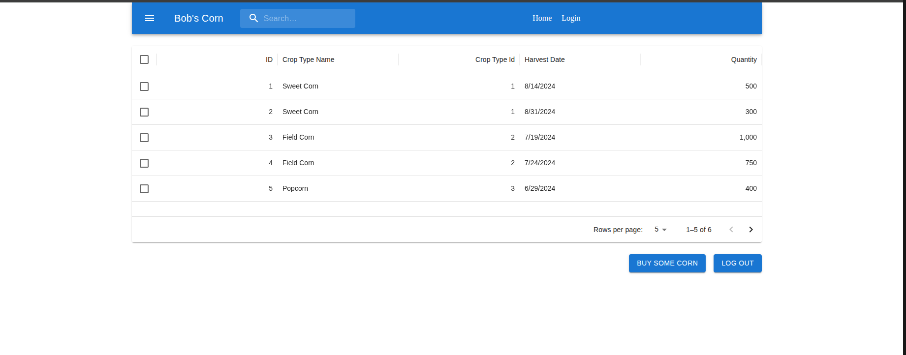

# BOB CORN CLIENT

> This is the frond end for the Bob web site.

# Screenshots

### Prerequisites

- JavaScript ES6
- React
- NodeJS

### Usage

1. Clone the repository by using the `git clone git@github.com:widzthedvloper/bob-corn-client.git` command in your terminal
2. `cd` into the cloned repository
3. Run `npm install or npm i`
4. Open the codebase using any code editor of your choice.
5. run `npm dev` and hit enter.

👤 **Widzmarc Jean Nesly Phelle**

- GitHub: [@widzthedvloper](https://github.com/widzthedvloper)
- LinkedIn: [@widzthedvloper](https://www.linkedin.com/in/widzmarc-jean-nesly-phelle-252a26129/)

### Show your support

Give a ⭐️ if you like this project!

## License

MIT License
